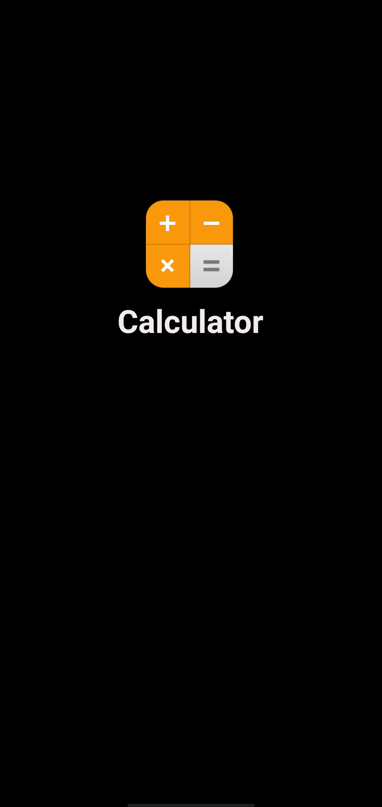
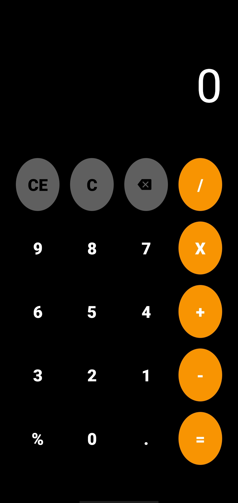

# Calculator

#This is simple claculator using kotlin

#This calculator contains two activity one is for splash screen and other is for main calculator

#SPLASH SCREEN
 

#CALCULATOR
 

#APP VIDEO

https://user-images.githubusercontent.com/88096617/162567303-81dbc4a6-ebdd-4b53-92f9-84197e363bac.mp4

